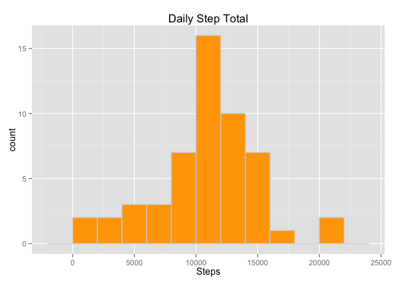

# Reproducible Research: Peer Assessment 1
Ian F. McCallum  
October 19, 2014  

**Prerequisites:** 

* The file 'activity.csv' is the working directory

### Loading and preprocessing the data

Read in the file 'activity.csv' and create a the *activity* dataframe


```r
library(plyr)
library(ggplot2)

activity <- read.csv("activity.csv")
```

### Question 1: What is mean total number of steps taken per day?

**Prerequisites:**

* The **plyr** package has been loaded
* The **ggplot2** package has been loaded

To plot the histogram of the number of steps, ddply is used to aggregate the data for each day using the data frame


```r
daily.activity <- ddply(activity, "date", summarise, daily.total=sum(steps))

p <- ggplot(daily.activity, aes(x=daily.activity$daily.total))
p <- p + geom_histogram(binwidth=2000, fill="orange", colour="lightgrey")
p <- p + ggtitle("Daily Step Total")
p <- p + xlab("Steps")

print(p)
```

 

The **mean** number of steps is 1.0766 &times; 10<sup>4</sup> <br>
The **median** number of steps is 1.0765 &times; 10<sup>4</sup>

### What is the average daily activity pattern?

**Prerequisites:**

* The **plyr** package has been loaded
* The **ggplot2** package has been loaded

To plot the activity by interveral, ddply is used to aggregate the data for each interval.


```r
interval.activity <- ddply(activity, "interval", summarise, mean.steps=mean(steps,na.rm=TRUE))

p <- ggplot(interval.activity, aes(x=interval, y=mean.steps))
p <- p + geom_dotplot()
p <- p + ggtitle("Interval Activity Patterns")
p <- p + xlab("Invterval")
p <- p + ylab("Steps")

print(p)
```

```
## stat_bindot: binwidth defaulted to range/30. Use 'binwidth = x' to adjust this.
```

 


The interval with the most activity is 835 with 206.2 steps

### Imputing missing values

**Prerequisites:**

* The **plyr** package has been loaded
* The **ggplot2** package has been loaded

The missing values will be replaced by the interval average for each individual interval. Then, ddply is used to aggregate the data for each day using the data frame to create a plot the histogram of the number of steps.


```r
fixed.activity <- activity
fixed.activity[is.na(fixed.activity$steps), "steps"] <- interval.activity[interval.activity$interval == fixed.activity[is.na(fixed.activity$steps),"interval"],"mean.steps"]

fixed.daily.activity <- ddply(fixed.activity, "date", summarise, daily.total=sum(steps))

p <- ggplot(fixed.daily.activity, aes(x=fixed.daily.activity$daily.total))
p <- p + geom_histogram(binwidth=2000, fill="lightblue", colour="lightgrey")
p <- p + ggtitle("Daily Step Total")
p <- p + xlab("Steps")

print(p)
```

 

The **mean** number of steps is 1.0766 &times; 10<sup>4</sup> <br>
The **median** number of steps is 1.0766 &times; 10<sup>4</sup>

A comparison of the means and medians from before the data was is presented below:<br>


The percentage difference between the repaired and original means is: -0.0019<br>
The percentage difference between the repaired and original medians is: 0.0056

Adding the mean values would not change the overall mean, but likely decreased the variance.

### Are there differences in activity patterns between weekdays and weekends?

**Prerequisites:**

* The **plyr** package has been loaded
* The **ggplot2** package has been loaded
* The *fixed.daily.activity* data frame has been created

The first task is to transform the *activities* data frame by add a column indicating whether the date falls during the week or weekend.


```r
fixed.activity <- transform(fixed.activity,weekend = weekdays(as.Date(fixed.activity$date)))
fixed.activity$weekend <- as.character(fixed.activity$weekend)

fixed.activity[fixed.activity$weekend %in% 
                 c("Monday", 
                   "Tuesday", 
                   "Wednesday", 
                   "Thursday", 
                   "Friday"), 4] <- "Weekday"
fixed.activity[fixed.activity$weekend %in% 
                 c("Saturday", 
                   "Sunday"), 4] <- "Weekend"

fixed.interval.activity <- ddply(fixed.activity, 
                                 c("interval","weekend"), 
                                 summarise, 
                                 mean.steps=mean(steps,na.rm=TRUE))

p <- ggplot(fixed.interval.activity, aes(x=interval, y=mean.steps))
p <- p + geom_dotplot()
p <- p + ylab("Steps")
p <- p + facet_wrap(~weekend, ncol=1)

print(p)
```

```
## stat_bindot: binwidth defaulted to range/30. Use 'binwidth = x' to adjust this.
## stat_bindot: binwidth defaulted to range/30. Use 'binwidth = x' to adjust this.
```

 
